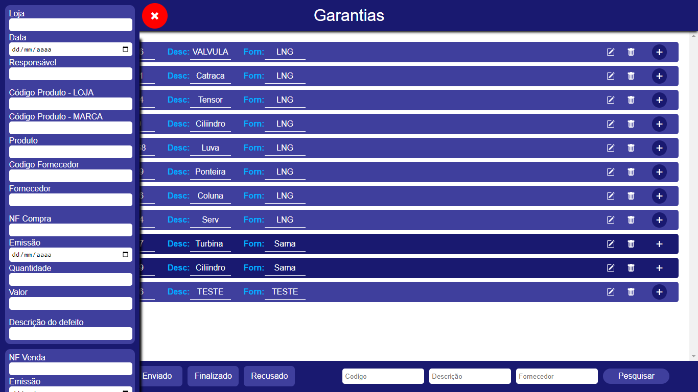

# Sistema de Gerenciamento de Garantias

Este projeto consiste em um sistema para gerenciamento de garantias, permitindo o registro e acompanhamento de processos relacionados a garantias de produtos. O objetivo é substituir o uso de planilhas do Excel para garantir maior praticidade e evitar a perda de dados.

## Tabela de Conteúdos

- [Instalação](#instalação)
- [Uso](#uso)
- [Contribuição](#contribuição)
- [Documentação Adicional](#documentação-adicional)
- [Próximos Passos](#próximos-passos)
- [Prints](#prints)
- [Estrutura do Projeto](#estrutura-do-projeto)

## Instalação

O projeto atualmente funciona em uma intranet, acessível dentro da empresa. Siga as instruções abaixo para configurar o sistema em sua máquina local:

1. Tenha uma conta no MongoDB Atlas.
2. Crie um arquivo `.env` na raiz do projeto.
3. Dentro do arquivo `.env`, adicione a variável `DB_URI` com o valor da URI de conexão com o MongoDB Atlas.
4. Defina uma porta (`PORT`) para o servidor em execução.
5. Execute o comando `npm run dev` no terminal para iniciar o servidor.
6. Acesse o sistema no seu navegador usando o endereço `http://localhost:[PORT]`.

## Uso

Após a instalação e configuração, você poderá utilizar o sistema para gerenciar as garantias da seguinte forma:

1. Faça login com as credenciais fornecidas no sistema.
2. Navegue pela interface para visualizar as garantias cadastradas.
3. Utilize os filtros de pesquisa para encontrar garantias específicas por código de peça, descrição de peça ou fornecedor.
4. Utilize as opções de atualizar e excluir para modificar ou remover um registro de garantia.
5. As garantias serão exibidas com cores diferentes, de acordo com o status: "Lançado", "Aberto", "Enviado", "Finalizado" ou "Recusado".

## Contribuição

Contribuições para o projeto são bem-vindas! Siga as diretrizes abaixo para contribuir:

- Faça um fork do repositório.
- Crie uma nova branch para a sua contribuição.
- Realize as modificações ou adições necessárias.
- Envie um pull request com uma descrição clara das suas alterações.

## Documentação Adicional

Acesse a documentação do MongoDB Atlas no link: [Documentação do MongoDB Atlas](https://docs.atlas.mongodb.com/)

## Próximos Passos

Os próximos passos planejados para o projeto são:

- Melhorar a parte de autenticação e permitir o cadastro de novos usuários.
- Testar e implementar a opção de salvar arquivos no Google Drive, em vez de usar o banco de dados.
- Explorar a possibilidade de funcionamento individual em cada máquina, sem a necessidade de um servidor.

## Prints

A seguir estão alguns prints do sistema:

## Estrutura do Projeto

A estrutura de arquivos e pastas do projeto segue o seguinte padrão:

projeto/
- .env
- .env.exemple
- .gitignore
- index.js
- package-lock.json
- package.json
- public/
  - js/
    - script.js
  - style/
    - login.css
    - style.css
  - ...
- src/
  - controllers/
    - user.controller.js
  - database/
    - db.js
  - models/
    - User.js
  - routes/
    - user.routes.js
  - utils/
    - data.utils.js
    - filters.utils.js
  - views/
    - components/
      - formEdit.ejs
      - formInclude.ejs
      - li.ejs
    - index.ejs
    - login.ejs
  - ...
- ...

